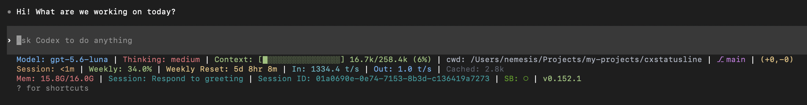

<div align="center">

<picture>
  <source media="(prefers-color-scheme: dark)" srcset="docs/banner-dark.png">
  
</picture>

# cxstatusline

**⚡ Your Codex session, at a glance.**

*Model, context, Git, usage, and reset timers. Your terminal, your layout.*

[](https://github.com/adrijshikhar/cxstatusline/actions/workflows/ci.yml)
[](https://www.npmjs.com/package/cxstatusline)
[](https://cxstatusline.adrijshikhar.dev)
[](https://cxstatusline.adrijshikhar.dev/#playground)
[](https://github.com/adrijshikhar/cxstatusline/discussions)
[](LICENSE)
[](https://nodejs.org/)


</div>

## 📑 Table of Contents

- [✨ Features](#-features)
- [🌐 Interactive Web Playground](#-interactive-web-playground)
- [📋 Requirements](#requirements)
- [🚀 Install](#-install)
- [🎛️ Configure](#️-configure)
- [🧩 Widgets Catalog](#widgets)
- [🔄 Update, Upgrade & Revert](#update)
- [🔍 How it Works](#-how-it-works)
- [🏷️ Supported Versions](#supported-versions)
- [🩺 Troubleshooting](#-troubleshooting)
- [🙏 Acknowledgments](#-acknowledgments)

## ✨ Features

**cxstatusline** is a configurable, one-to-three-row statusline & status bar for the [OpenAI Codex CLI](https://github.com/openai/codex) (bringing the rich statusbar experience of [ccstatusline](https://github.com/sirmalloc/ccstatusline) for Anthropic Claude Code to OpenAI Codex).

- **⚡ Live Codex Telemetry**: Monitor active model, reasoning effort, context token window usage (`k/200k`), session duration, and rate limit reset countdowns in real time.
- **🌿 Git Status & Branch**: Always see current branch and unstaged/staged change counters (`+42, -10`) right in your Codex prompt.
- **🎨 Powerline Themes & ANSI Colors**: Choose from built-in Powerline separators (arrows, angled, curved, flame), 16/256/TrueColor palettes, or design custom rows.
- **🖥️ Interactive Terminal TUI**: Configure your layout visually inside your terminal (`cxstatusline`) or in the web playground.
- **🔄 ccstatusline Compatibility**: Preset syntax and widget IDs match ccstatusline, making transition from Claude Code seamless.

Independent project; not an official OpenAI product.

## 🌐 Interactive Web Playground

Try out themes, arrange widgets, and preview your custom OpenAI Codex statusline directly in your browser without installing anything:
👉 **[cxstatusline.adrijshikhar.dev](https://cxstatusline.adrijshikhar.dev)**

<details>
<summary>See the footer inside Codex</summary>



</details>

## Requirements

- **macOS 14 (Sonoma) or newer** (Apple Silicon or Intel) or **Linux** (x86_64 or aarch64).
- **Node.js 22+**.
- **Existing Codex CLI installation** kept in place (`~/.codex/`).
- **Git**.
- **Rust toolchain** (1.95.0+) is required only if building from source (`--compile`).

## 🚀 Install

Install globally with npm:

```sh
npm install -g cxstatusline
cxstatusline install
cxstatusline doctor
```

`cxstatusline install` downloads the verified prebuilt binary matching your Codex version, verifies checksums against `manifest.json`, and activates it.
- **Interactive selection**: Running `cxstatusline install` opens a keyboard-driven version picker. Use ↑/↓ and Enter to select, or Escape/Ctrl+C to cancel. Prebuilt availability is shown per version; source-only choices require confirmation (unless you already passed `--compile`).
- **Upgrade choices**: `cxstatusline upgrade` uses the same keyboard controls to choose the latest supported prebuilt, a supported source build, or cancellation. It does not update upstream Codex first.
- **Live progress**: Ink renders download progress in terminals while completed stages remain in the transcript. Source builds report their phases; redirected output retains plain milestone logs.
- **Target a specific version**: `cxstatusline install --codex-version <version>` (e.g. `cxstatusline install --codex-version 0.154.0`).
- **Non-interactive / CI**: Pass `-y` or `--yes` to accept the default without prompting.

Start Codex, accept its cxstatusline hook trust prompt, and open a new session after installation. An already-running process does not switch binaries when installation finishes.

<details>
<summary>Install from git checkout</summary>

```sh
git clone https://github.com/adrijshikhar/cxstatusline.git
cd cxstatusline
bun install --frozen-lockfile
bun run link:local
export PATH="$HOME/.local/bin:$PATH"
cxstatusline install
cxstatusline doctor
```

</details>

<details>
<summary>Build from source instead</summary>

If you prefer to compile the patched Codex binaries locally from source:

```sh
rustup toolchain install 1.95.0 --component clippy --component rustfmt --component rust-src
git clone https://github.com/adrijshikhar/cxstatusline.git
cd cxstatusline
bun install --frozen-lockfile
bun run link:local
export PATH="$HOME/.local/bin:$PATH"
cxstatusline install --compile
cxstatusline doctor
```

`install --compile` clones the exact upstream tag for your Codex version into `~/.local/share/cxstatusline/codex/`, applies the tested patch, builds both `codex` and `codex-code-mode-host`, verifies them, and activates them. Local compilation requires at least 20 GiB of free disk space and takes tens of minutes on a cold build.

</details>

## 🎛️ Configure

```sh
cxstatusline
```

The bare command opens the configuration TUI in an interactive terminal. Choose widgets, colors
and themes, preview, then save explicitly or press Ctrl+S. Settings live at
`~/.config/cxstatusline/settings.json` (or your XDG config location).

For scripts, `cxstatusline render` reads a versioned JSON payload on stdin and prints ANSI rows;
it never opens the TUI.

## Widgets

36 widgets: model and thinking effort, Git branch and changes, context and token counts, token speed,
5-hour and weekly usage and reset, session clock and name, working directory, terminal width, memory, plus three
custom widgets that show your own text, symbol, or the output of a shell command.

Type IDs match ccstatusline's, so a ccstatusline preset imports without translation.

👉 The full catalog, and how Custom Command handles timeouts, colours and background caching, are in
the **[Usage guide](docs/usage.md)**.

## Update & Upgrade

cxstatusline follows the Homebrew paradigm for managing updates:
- **`cxstatusline update`**: Updates the **cxstatusline CLI tool itself** to the latest release (via npm, bun, or git).
- **`cxstatusline upgrade`**: Upgrades the **patched Codex binary pair** to the latest supported release.

### Updating cxstatusline (The Tool)

```sh
cxstatusline update          # Updates cxstatusline to the latest version
cxstatusline update --check  # Checks for available tool updates without installing
```

`cxstatusline update` automatically detects your install method (`npm`, `bun`, or `git checkout`) and updates the CLI tool.

### Upgrading Patched Codex

```sh
cxstatusline upgrade
```

`cxstatusline upgrade` downloads and verifies the latest published prebuilt supported by your cxstatusline package, then activates the complete patched Codex pair. It does not run Codex's self-updater or modify your original Codex installation. Open a new Codex session afterward.

The same Codex version is checked for rebuilt patch assets; a newer installed version is never downgraded. If discovery or verification fails, the active pair stays in place. When running `upgrade`, if a newer version of `cxstatusline` is available, it will display a friendly reminder to run `cxstatusline update` first.

Options:
- `cxstatusline upgrade --compile`: builds the latest locally supported Codex patch from source instead.
- `--force`, `-y`, and `--yes` remain accepted for compatibility; updates already run without a prompt and always verify the pair.
- Note: Running `cxstatusline update --compile` or `--force` will automatically forward to `cxstatusline upgrade` with a notice.

Session-start updates also leave a newer patched pair in place when the original Codex installation is older, including under the `every` policy.

## Revert

```sh
cxstatusline revert
```

`cxstatusline revert` restores the stock launcher, removes CX-owned executables, generations, and the hook, and keeps settings and source. Generations are kept until revert; close Codex sessions first.

## 🔍 How it works
 
Codex CLI does not yet provide a native statusline extension hook ([openai/codex#17827](https://github.com/openai/codex/issues/17827)). `cxstatusline` bridges this with a lightweight additive Rust patch that captures session telemetry (model, context tokens, Git branch, rate limits) and invokes a local Node/TypeScript ANSI renderer.
 
Updates use an immutable **generation-based layout** (`~/.local/libexec/cxstatusline/generations/`) with atomic symlink swaps, ensuring your active terminal sessions are never interrupted.
 
👉 For a full architectural breakdown of how Codex is patched with Rust, check out the **[Architecture & Technical Deep Dive (wiki.md)](wiki.md)**.
 
## Supported versions

cxstatusline matches exact stable releases of OpenAI Codex.

### Latest Supported Version
| Codex Target | Prebuilt Release | Supported Architecture | Status |
|---|---|---|---|
| **0.155.0** | [`codex-v0.155.0`](https://github.com/adrijshikhar/cxstatusline/releases/tag/codex-v0.155.0) | Apple Silicon (`darwin-arm64`) | ✅ Verified Prebuilt |

<details>
<summary><b>Previous Supported Versions</b></summary>
<br>

| Codex Target | Prebuilt Release | Supported Architecture | Status |
|---|---|---|---|
| **0.154.0** | [`codex-v0.154.0`](https://github.com/adrijshikhar/cxstatusline/releases/tag/codex-v0.154.0) | Apple Silicon (`darwin-arm64`) | ✅ Verified Prebuilt |
| **0.153.4** | [`codex-v0.153.4`](https://github.com/adrijshikhar/cxstatusline/releases/tag/codex-v0.153.4) | Apple Silicon (`darwin-arm64`) | ✅ Verified Prebuilt |
| **0.153.0** | [`codex-v0.153.0`](https://github.com/adrijshikhar/cxstatusline/releases/tag/codex-v0.153.0) | Apple Silicon (`darwin-arm64`) | ✅ Verified Prebuilt |
| **0.152.1** | [`codex-v0.152.1`](https://github.com/adrijshikhar/cxstatusline/releases/tag/codex-v0.152.1) | Apple Silicon (`darwin-arm64`) | ✅ Verified Prebuilt |

To install a specific version:
```sh
cxstatusline install --codex-version 0.154.0
```
</details>

Rust patch versions are independent of Codex and cxstatusline package versions. Each supported Codex version belongs to exactly one patch version:

| Rust patch | Tested Codex versions |
| --- | --- |
| v1 | 0.152.1, 0.153.0, 0.153.1, 0.153.4, 0.154.0, 0.155.0, 0.155.1 |
| v2 | 0.156.0, 0.156.1 |

Codex 0.153.1 is validated on macOS ARM64; its prebuilt release is pending. Compatibility entries do not imply that a prebuilt has already been published.

`patches/manifest.json` records that ownership with `patchVersion` on each compatibility entry. Its `version: 2` is the manifest format, not the Rust patch version. Entries can describe inclusive ranges, but we currently list only the exact tested versions. Version-specific patch files remain separate because upstream source layouts differ.

Add newly tested Codex versions to the existing patch version while it continues to work. When a newer Codex needs a changed Rust integration, introduce the next patch version for that Codex version and future compatible releases. Do not backport it or reassign older Codex versions. Overlapping entries are rejected.

New builds record the patch version in release and installation metadata; `cxstatusline doctor` displays it. Older releases remain readable and report `unknown (legacy)` rather than guessing. New prebuilt manifests use schema 2, so installing them requires a cxstatusline package that supports this format. Release tags remain `codex-v<version>`.

Rebuilding an existing Codex tag replaces its complete release asset set. The workflow verifies the new build, downloads and verifies every old asset, and saves a 90-day workflow artifact before mutation. The Git tag remains; the release may be briefly unavailable while the replacement is uploaded and verified. If automatic recovery fails, download the matching `release-backup-<tag>-<run-id>` artifact and restore it with `bun scripts/prebuilt.ts restore --tag codex-v0.156.1 --codex-version 0.156.1 --backup-dir ./release-backup --repo adrijshikhar/cxstatusline`.

If your Codex version is not listed, cxstatusline fails closed: it will neither download an unverified prebuilt nor attempt source compilation. New versions require a tested patch file, an entry in `patches/manifest.json`, and a release workflow run.

The daily upstream watcher audits every stable release in the newest Codex major.minor series and only the `.0` baseline of older series, at or above the support floor. For example, while 0.156.x is newest, 0.156.0 and 0.156.1 are required alongside 0.155.0; 0.155.1 is not a backfill requirement. Existing published assets and tested compatibility mappings are retained. It updates one `Codex release coverage gaps` issue and uploads a machine-readable report. A separate watchdog fails if no successful scheduled watcher run has completed in the last 36 hours. Enable repository **Settings → Notifications → Actions** and select failed workflow runs (or enable email notifications for Actions) to receive these failures. The watchdog runs inside GitHub Actions, so a GitHub-wide scheduling outage cannot be detected from within GitHub.
 
## 🩺 Troubleshooting
 
- **No footer:** Run `cxstatusline doctor`, verify `which codex` points to `~/.local/bin/codex`, check your `PATH`, accept the hook prompt in Codex, and start a fresh session.
- **Unsupported version:** Wait for an explicitly supported patch. `--force` does not bypass version compatibility. Keep a working stock Codex installation.
- **Failed build:** Inspect `~/.local/state/cxstatusline/patch.log`, fix the prerequisite, then run `cxstatusline patch --force`. Redact personal paths, session identifiers, and secrets before sharing logs.
- **Missing companion / interrupted install:** Run `cxstatusline doctor`. Use `cxstatusline revert` to return to stock before reinstalling if unhealthy. Do not manually replace only one binary.
 
## 🙏 Acknowledgments
 
Huge shout-out to **[ccstatusline](https://github.com/sirmalloc/ccstatusline)** by [@sirmalloc](https://github.com/sirmalloc)! The interactive configurator TUI, widget architecture, Powerline themes, and overall statusline UX in `cxstatusline` are directly adapted and inspired by `ccstatusline`'s fantastic work for Claude Code.
 
## License
 
cxstatusline is [MIT licensed](LICENSE). See [SECURITY.md](SECURITY.md) for security boundaries and reporting. [NOTICE](NOTICE) and [THIRD_PARTY_NOTICES.md](THIRD_PARTY_NOTICES.md) preserve upstream attribution. OpenAI Codex remains separately licensed under Apache-2.0.

---

- 🌐 **Web Playground:** [cxstatusline.adrijshikhar.dev](https://cxstatusline.adrijshikhar.dev)
- 💬 **Discussions & Ideas:** [github.com/adrijshikhar/cxstatusline/discussions](https://github.com/adrijshikhar/cxstatusline/discussions)
- 📦 **npm Package:** [npmjs.com/package/cxstatusline](https://www.npmjs.com/package/cxstatusline)

### Prebuilt build machine

All Codex prebuilt jobs run on the owner's M5 Pro (`192.168.1.65`, Actions labels
`self-hosted`, `macOS`, `ARM64`, `m5-pro`). macOS builds natively; Linux builds in
Docker on that same M5. Keep the laptop and runner active until the workflow finishes.
An offline M5 leaves jobs queued; there is no hosted fallback. Platform builds run
sequentially, preserving 3 native Rust compiler jobs and 8 inside Docker. Dispatch from a ref containing this policy;
older release tags may still contain the removed hosted-runner option.
