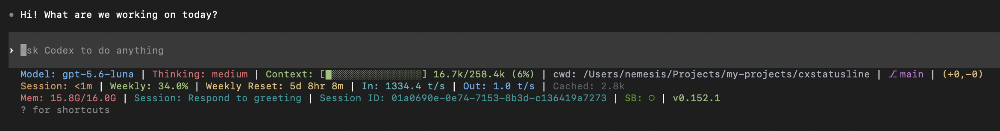

<div align="center">

<picture>
  <source media="(prefers-color-scheme: dark)" srcset="docs/banner-dark.png">
  
</picture>

# cxstatusline

**⚡ Your Codex session, at a glance.**

*Model, context, Git, usage, and reset timers. Your terminal, your layout.*

[](https://github.com/adrijshikhar/cxstatusline/actions/workflows/ci.yml)
[](https://www.npmjs.com/package/cxstatusline)
[](https://cxstatusline.adrijshikhar.dev)
[](https://cxstatusline.adrijshikhar.dev/#playground)
[](https://github.com/adrijshikhar/cxstatusline/discussions)
[](LICENSE)
[](https://nodejs.org/)


</div>

## ✨ Features

**cxstatusline** is a configurable, multi-row statusline & status bar for the [OpenAI Codex CLI](https://github.com/openai/codex).

- **⚡ Live Codex Telemetry**: Monitor active model, reasoning effort, context token window (`k/200k`), session duration, and rate limit reset countdowns in real time.
- **🌿 Git Status & Branch**: Always see current branch and unstaged/staged change counters (`+42, -10`) directly in your Codex prompt.
- **🎨 Powerline Themes & ANSI Colors**: Choose from built-in Powerline separators (arrows, angled, curved, flame), 16/256/TrueColor palettes, or design custom rows.
- **🖥️ Interactive Terminal TUI**: Configure your layout visually inside your terminal (`cxstatusline`) or in the web playground.
- **🧩 36 Built-in Widgets**: From token speed to session clocks, working directory, and custom shell command outputs.

*Note: cxstatusline is an independent open-source project and is not affiliated with or endorsed by OpenAI.*

## 🌐 Interactive Web Playground

Try out themes, arrange widgets, and preview your custom OpenAI Codex statusline directly in your browser without installing anything:
👉 **[cxstatusline.adrijshikhar.dev](https://cxstatusline.adrijshikhar.dev)**

<details>
<summary>See the footer inside Codex</summary>



</details>

## 📋 Requirements

- **macOS 14 (Sonoma)+** (Apple Silicon or Intel) or **Linux** (x86_64 or aarch64).
- **Node.js 22+**.
- **Existing Codex CLI installation** (`~/.codex/`).
- Prebuilt installs require no extra dependencies beyond Node.js.

## 🚀 Quick Start

Install globally with npm and run the interactive setup:

```sh
npm install -g cxstatusline
cxstatusline install
cxstatusline doctor
```

- **Interactive Selection**: `cxstatusline install` opens a keyboard-driven version picker showing verified prebuilts matching your Codex release.
- **Target a Version**: Target a specific version directly with `cxstatusline install --codex-version <version>` (e.g. `cxstatusline install --codex-version 0.159.3`).
- **Non-Interactive / CI**: Pass `-y` or `--yes` to accept defaults automatically.

After installation, start Codex and accept its hook trust prompt.

<details>
<summary>Build from source instead</summary>

If you prefer to compile patched Codex binaries locally from source:

```sh
rustup toolchain install 1.95.0 --component clippy --component rustfmt --component rust-src
npm install -g cxstatusline
cxstatusline install --compile
cxstatusline doctor
```
*(Requires Rust 1.95.0+, Python 3.10+, and ~20 GiB free disk space).*

</details>

## 🎛️ Configure

```sh
cxstatusline
```

Running `cxstatusline` opens the interactive configurator TUI right in your terminal. Select widgets, change colors and Powerline symbols, preview changes live, and press `Ctrl+S` to save. Settings are stored at `~/.config/cxstatusline/settings.json`.

For automated scripting, `cxstatusline render` reads a JSON payload on stdin and prints ANSI strings without launching the TUI.

## 🧩 Widgets Catalog

Includes 36 modular widgets across several categories:
- **Telemetry & Models**: Active model, reasoning effort, context token progress, token speed (input/output/total).
- **Git & Workspace**: Branch, dirty indicators, staged/unstaged diff stats, current working directory.
- **Session & Limits**: 5-hour & weekly usage quotas, reset countdown timers, session clock, and duration.
- **Custom Widgets**: Show your own static text, custom glyphs, or run arbitrary shell commands with background caching.

👉 See the **[Usage Guide (docs/usage.md)](docs/usage.md)** for full widget options, custom command caching, and color configuration.

## 🔄 Update, Upgrade & Revert

cxstatusline follows the Homebrew paradigm:

```sh
# Update cxstatusline CLI tool
cxstatusline update

# Upgrade patched Codex binary to the latest supported release
cxstatusline upgrade

# Safely revert and restore your original stock Codex launcher
cxstatusline revert
```

- `cxstatusline update`: Checks for and updates the CLI tool via npm, bun, or git.
- `cxstatusline upgrade`: Downloads and verifies the latest published prebuilt for your Codex installation.
- `cxstatusline revert`: Restores the original unmodified Codex binaries and removes all cxstatusline hooks and generations.

## 🏷️ Supported Versions

cxstatusline supports official releases of the OpenAI Codex CLI on macOS and Linux.

👉 **View the full interactive list**: **[cxstatusline.adrijshikhar.dev/#compatibility](https://cxstatusline.adrijshikhar.dev/#compatibility)**

You can also run `cxstatusline install` at any time to browse supported releases interactively in your terminal. If your version isn't listed, you can [request support on GitHub](https://github.com/adrijshikhar/cxstatusline/issues/new?template=request-version.md).

## 🔍 How it Works

OpenAI Codex does not yet provide a native statusline extension API ([openai/codex#17827](https://github.com/openai/codex/issues/17827)). `cxstatusline` bridges this with a lightweight additive Rust patch in `codex-tui` that extracts runtime session telemetry (model, tokens, Git branch, rate limits) and sends it over stdio to a high-performance local TypeScript ANSI renderer.

Updates use an immutable **generation-based directory layout** (`~/.local/libexec/cxstatusline/generations/`) with atomic symlink swaps, ensuring active terminal sessions are never interrupted.

👉 For full architectural diagrams and deep dive, see **[wiki.md](wiki.md)**.

## 🩺 Troubleshooting

- **No statusline visible?** Run `cxstatusline doctor`, verify `which codex` points to `~/.local/bin/codex`, check your `PATH`, accept the hook prompt inside Codex, and restart your terminal session.
- **Interrupted installation?** Run `cxstatusline doctor`. You can run `cxstatusline revert` at any time to safely restore stock Codex before reinstalling.
- **Diagnostics**: Run `cxstatusline doctor` to inspect active generation symlinks, daemon status, and binary checksums.

## 🙏 Acknowledgments

Huge shout-out to **[ccstatusline](https://github.com/sirmalloc/ccstatusline)** by [@sirmalloc](https://github.com/sirmalloc)! The interactive configurator TUI, widget architecture, Powerline themes, and overall statusline UX in `cxstatusline` are directly adapted and inspired by `ccstatusline`'s fantastic work for Claude Code.

## 📄 License

MIT © [Adrij Shikhar](https://github.com/adrijshikhar). See [LICENSE](LICENSE) for details. OpenAI Codex remains separately licensed under Apache-2.0.
